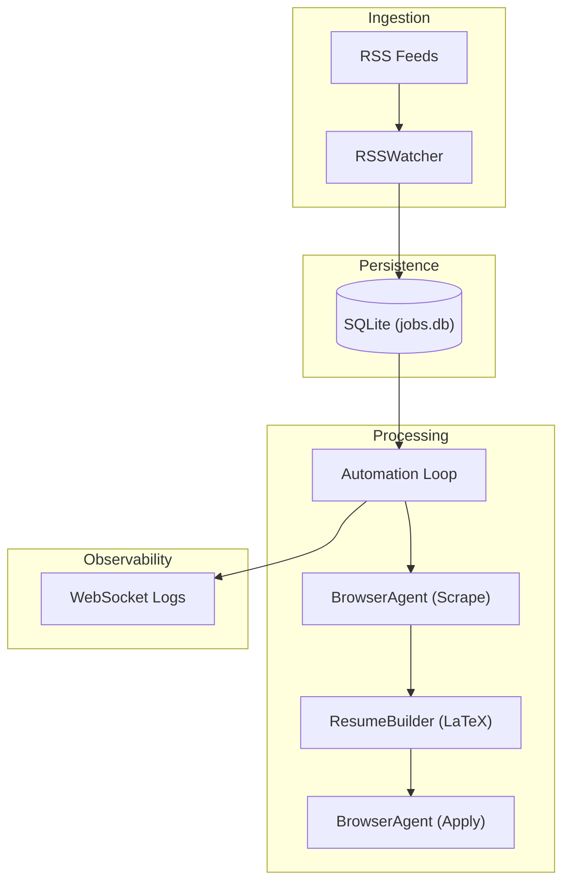

# AutoApply

AutoApply is an orchestration engine for the automated job application lifecycle. It bridges the gap between raw job discovery (via RSS) and high-fidelity submission (via LLM-driven browser automation).

## Overview

The system is designed to automate the repetitive, low-leverage phases of job hunting—keyword extraction, resume tailoring, and form submission—while maintaining the user's role as the authoritative source of experience data (LaTeX templates) and opportunity filters (RSS feeds).

### High-Level Intent
Reliability and maintainability over feature density. The system treats each application as a stateful transaction moving through a clear lifecycle, designed to be operated in a headless, long-running production environment.

## Non-Goals

- **Universal Web Scraping**: We do not attempt to parse every job board's unique DOM. We delegate page interpretation to an LLM-driven agent.
- **Content Generation**: The system does not "write" resumes. It performs targeted keyword injection into pre-existing LaTeX structures.
- **Enterprise Scheduling**: No internal cron or job queue (e.g., Celery). Use OS-level orchestration (systemd, Kubernetes) for scheduling.
- **Multi-Tenant Security**: The current API is unauthenticated and assumes deployment within a trusted network or behind a generic auth proxy.

## Core Concepts

### Abstractions
- **Job**: The primary entity, uniquely identified by its URL.
- **Watcher**: A stateless polling component for data ingestion.
- **Agent**: An LLM-wrapped browser instance capable of reasoning about DOM elements.
- **Registry**: A persistence layer (SQLite) managing the state machine.

### Invariants
- **URL Singularity**: A job URL can exist in exactly one state across the entire system.
- **Immutable History**: Once a job reaches a terminal state (`Completed` or `Failed`), its metadata is preserved for audit.
- **Consistency**: PDF compilation requires a valid LaTeX toolchain; the system fails fast if the environment is incomplete.

## Architecture

The system follows a modular architecture with clear boundaries between ingestion, processing, and execution.



### Data Flow
1. **Ingestion**: `RSSWatcher` pulls entries and persists new URLs to SQLite with `Pending` status.
2. **Scraping**: The loop picks up `Pending` jobs. `BrowserAgent` extracts the job description using `google/gemini-2.0-flash-001`.
3. **Tailoring**: `ResumeBuilder` identifies keywords, injects them into `\VAR{skills_list}` in the LaTeX template, and compiles to PDF.
4. **Submission**: `BrowserAgent` navigates to the application URL and fills forms using structured `profile.json` data.

## Design Decisions

### LLM-Driven Browser Automation
**Decision**: Use `browser-use` with Gemini/Llama models instead of static Playwright selectors.
**Trade-off**: High flexibility across different job boards at the cost of non-deterministic behavior and LLM latency. We mitigate this with high `max_failures` limits and DOM-only mode.

### SQLite Persistence
**Decision**: Recently migrated from JSON files to SQLite.
**Trade-off**: Adds a dependency on `sqlite3` but provides ACID compliance and prevents data corruption during concurrent API/Loop operations.

### Serial Execution
**Decision**: Single async processing loop.
**Trade-off**: Limits throughput to ~1 application per 2-5 minutes. This is intentional to avoid rate-limiting/IP blocking and to keep the resource footprint minimal.

## Operational Model

### Startup Sequence
1. **Environment Load**: Validate `OPENROUTER_API_KEY` and LaTeX presence.
2. **Database Init**: Automically migrates legacy `jobs.json` to SQLite on first run.
3. **Static Mounting**: Exposes `data/` for resume downloads.
4. **Service Launch**: FastAPI server starts on port 8000; the automation loop remains dormant until a `/start` signal.

### Failure Modes
| Scenario | Impact | Recovery |
|----------|--------|----------|
| LLM Rate Limit | Job Failure | Automatic retry not implemented; manual reset to `Pending` required. |
| DOM Mutation | Agent Confusion | Agent retries up to 10 times internally before reporting terminal failure. |
| LaTeX Syntax Error | Compilation Halt | Job marked `Failed`. Correct `resume_base.tex` and retry. |

### Observability
Real-time operations are exposed via `ws://localhost:8000/ws/logs`. Production environments should pipe these to a structured logging aggregator.

## Extensibility

- **Sources**: New ingestion sources can be added by implementing the `EventPublisher` interface and pushing to `new_job_ingested`.
- **Templates**: Users can upload custom `.tex` files. The system only requires the `\VAR{skills_list}` Jinja2 placeholder.
- **Models**: The system is LLM-agnostic via OpenRouter. Change `DEFAULT_MODEL` in `BrowserAgent` to swap providers.

## Local Development

### Prerequisites
- Python 3.11+
- Node.js 18+
- `pdflatex` (TeX Live or MiKTeX)
- Chromium (`playwright install chromium`)

### Backend Setup
```bash
cd backend
pip install -r requirements.txt
python -m playwright install chromium
uvicorn api.server:app --host 0.0.0.0 --port 8000
```

### Frontend Setup
```bash
cd frontend
npm install
npm run dev
```

## Testing & Validation

- **E2E Workflow**: The primary validation is the integration test suite (`backend/tests/test_e2e_workflow.py`), which simulates a full run from discovery to submission.
- **Mocking**: LLM calls are mocked in unit tests, but real LLM runs are used for verification before release.
- **Excluded**: Visual regression for the frontend is currently out of scope.

## Known Limitations

1. **Auth**: No per-user authentication. Secure your deployment via VPC or Reverse Proxy.
2. **Concurrency**: The `JobManager` is thread-safe via SQLite, but the `BrowserAgent` is designed for a single instance.
3. **Captcha**: Complex bot-detection (hCaptcha/Cloudflare) may bypass the LLM agent. Use headed mode for manual intervention if needed.

## Future Work

- **Exponential Backoff**: Implementation of a retry strategy for LLM/Network transients.
- **Job Deduplication**: Content-based hashing to avoid processing the same job across different RSS aggregators.
- **Health Check API**: `/health` endpoint for container orchestration readiness/liveness probes.

---
*Maintained by the Engineering Team. If you encounter an undocumented failure mode, please open a PR with the update.*
