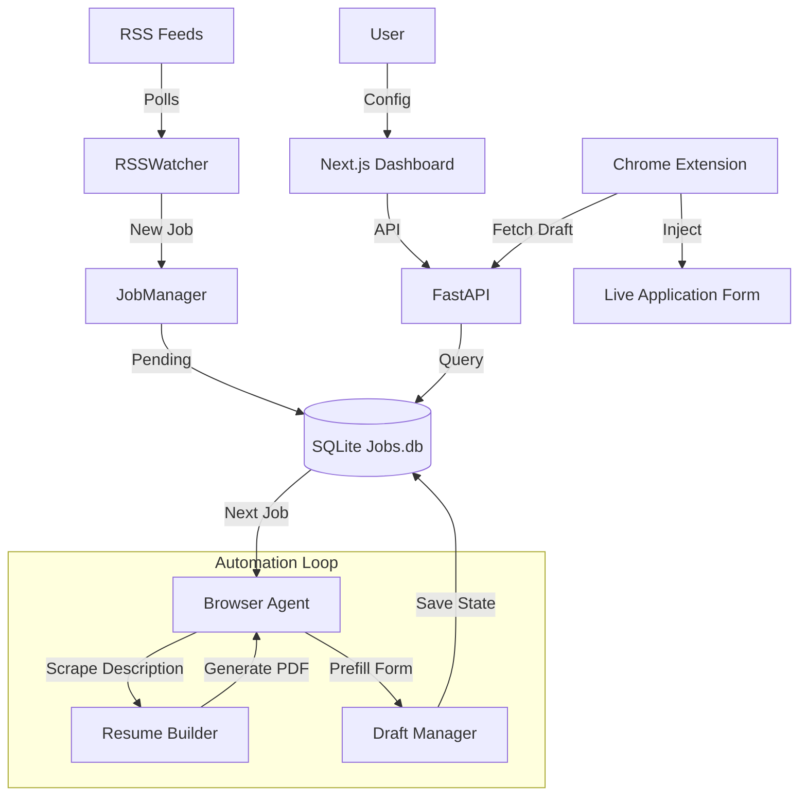

# 🚀 AutoApply

> **Automated Job Application Preparation System**

**AutoApply** is an intelligent automation tool designed to streamline the job application process. It ingests job postings from RSS feeds, uses LLMs to extract key requirements, generates tailored resumes, and prefills application forms—giving you full control before the final submission.

---

## 🛠 Tech Stack

| Category | Technologies |
| :--- | :--- |
| **Backend** |   |
| **Frontend** |   |
| **Database** |  |
| **Automation** |   |
| **AI / LLM** |   |
| **DevOps** |  |

---

## ✨ Features

-   **📡 RSS Ingestion**: Automatically polls configured job boards hourly and deduplicates listings.
-   **🕷️ LLM-Driven Scraping**: Uses Gemini Flash via `browser-use` to intelligently extract job descriptions from any layout.
-   **📄 Tailored Resumes**: Identifies keywords and dynamically injects them into a LaTeX template to generate a custom PDF.
-   **✍️ Smart Form Prefilling**: Navigates application pages and autofills fields based on your profile data.
-   **💾 Draft Persistence**: Saves form state (Draft Mode) so you can review and finish applications later.
-   **🧩 Chrome Extension**: Rehydrates your saved drafts directly onto the live job board for final manual review.
-   **🛡️ Safety First**: **No auto-submit.** The system stops at the draft stage, ensuring you always review before applying.

---

## 🏗 Architecture

The system follows a modular architecture designed for reliability and control.



### Core Components
-   **RSSWatcher**: Monitors job feeds.
-   **JobManager**: Manages the state machine (`Pending` → `Running` → `Draft Saved`).
-   **BrowserAgent**: LLM-controlled browser for navigating and scraping.
-   **ResumeBuilder**: Compiles tailored modular resumes using `pdflatex`.
-   **Chrome Extension**: Bridges the gap between the saved backend state and the browser for final submission.

---

## 🚀 Getting Started

### Prerequisites
-   **Python 3.11+**
-   **Node.js 18+**
-   **pdflatex** (TeX Live or MikTeX)
-   **Docker** (Optional, for containerized run)

### ⚡ Quick Start (Docker)

1.  **Clone the repository**
    ```bash
    git clone https://github.com/yourusername/AutoApply.git
    cd AutoApply
    ```

2.  **Configure Environment**
    Create a `.env` file in the root:
    ```bash
    echo "OPENROUTER_API_KEY=sk-or-..." > .env
    ```

3.  **Run with Docker Compose**
    ```bash
    docker compose up --build
    ```

4.  **Access the Dashboard**
    -   Frontend: `http://localhost:3000`
    -   Backend API: `http://localhost:8000/docs`

### 🔧 Manual Setup

**Backend:**
```bash
cd backend
python -m venv venv
source venv/bin/activate
pip install -r requirements.txt
playwright install chromium
uvicorn api.server:app --host 0.0.0.0 --port 8000
```

**Frontend:**
```bash
cd frontend
npm install
npm run dev
```

---

##  workflow

1.  **Configure**: Add your target RSS feeds in the dashboard.
2.  **Monitor**: Watch as jobs appear in the queue.
3.  **Automate**: The system scrapes the job, builds a resume, and attempts to prefill the application.
4.  **Review**: Open the "Draft" link. Identifying info and keywords are pre-filled.
5.  **Submit**: Verify the data and click Submit on the job board.

---

*Take control of your job search with intelligent automation.*
